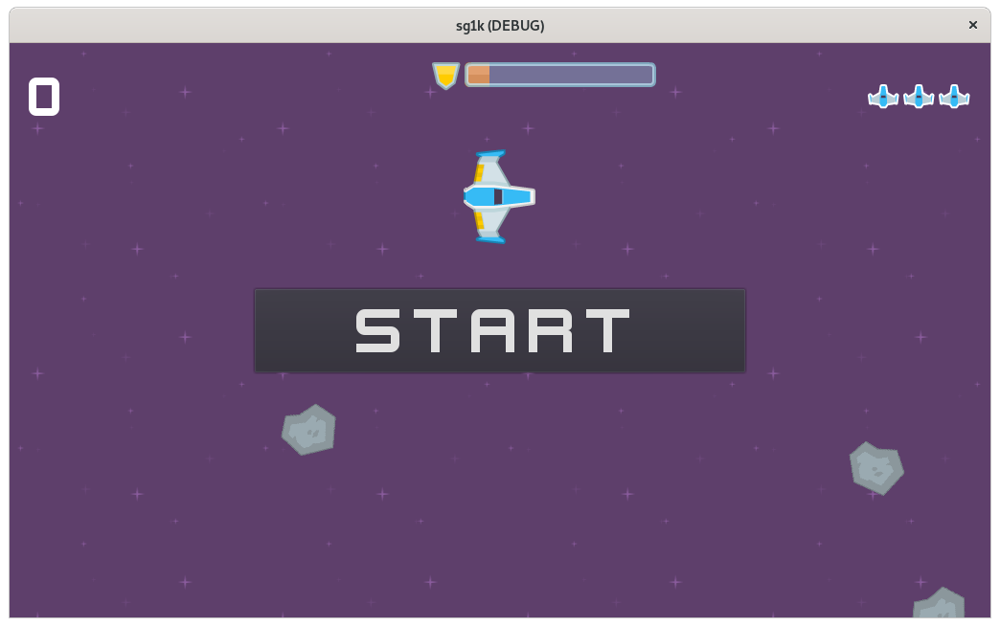

# sg1k

Space Guardian 1000

Like Asteroids, I guess...

### Screenshot

### Credits

 - Art and Sounds provided by Kenney.nl
	- https://kenney.nl/assets/space-shooter-redux

 - Space Engine Noise: "engine3.wav"
 	- Reemax: https://opengameart.org/content/space-ship-engine-sounds
 	- Edited with Audacity to shorten to 0.5 sec burst sound

 - Space Music: 
 	- Szymon Matuszewski:  https://opengameart.org/content/szymon-matuszewski-space-chase
 	- Using "Space Walk" whenever a level starts

 - Explosion Sound: "explosion.ogg"
 	- NenadSimic:  https://opengameart.org/content/muffled-distant-explosion
 	- Shortened and turned into .ogg with Audacity

### Tools Used

- Godot Engine: https://godotengine.org/

- Pixelorama: https://orama-interactive.itch.io/pixelorama

- Inkscape: https://inkscape.org/

- Gimp: https://www.gimp.org/

- OBS:  https://obsproject.com/download

- OpenShot: https://www.openshot.org

- Audacity:  https://www.audacityteam.org/